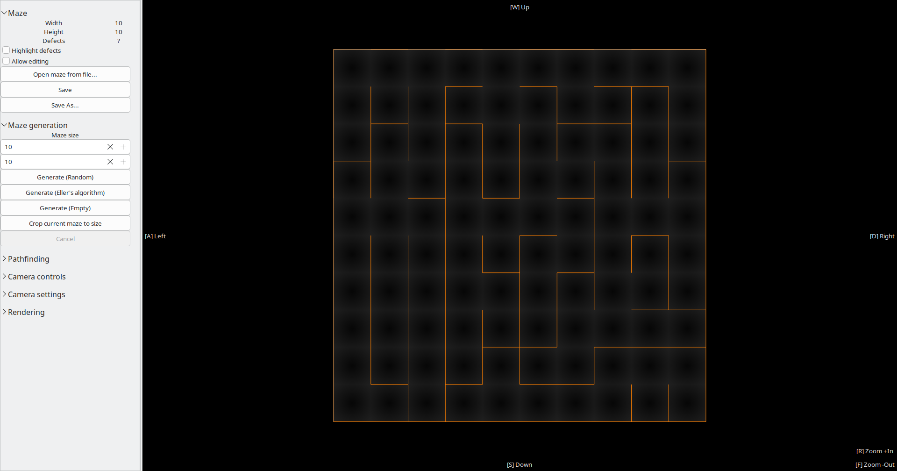

# WORK IN PROGRESS, not all base features are implemented yet
# maze

Program for viewing, generating, and solving 2D rectangular mazes of different sizes.

[WIP]: saving/reading files does not work currently.

[WIP]: pathfinding works, but does not have a UI for now.

## Quick demo

### "Eller's" Maze 10x10



### "Eller's" Maze 30k x 30k

Video demo: [https://youtu.be/3iz2aonj-l0](https://youtu.be/3iz2aonj-l0)

## Building (CMake)

Dependencies: `PkgConfig`, `gtk3`, `glib`, `libepoxy`, `gtest`.
Project assumes you have dependencies installed externally.

Do not forget to update submodules!

Regular way:
```bash
$ git submodule update --init --recursive
$ cmake -S . -B build
$ cmake --build build
$ cmake --install
```

Or a quick way:
```bash
$ git submodule update --init --recursive
$ make r c b i gtk
```
- `make r` cleans artifacts,
- `make c` does cmake configuration, 
- `make b` - cmake build, 
- `make i` - cmake install, 
- `make gtk` - runs installed application.
